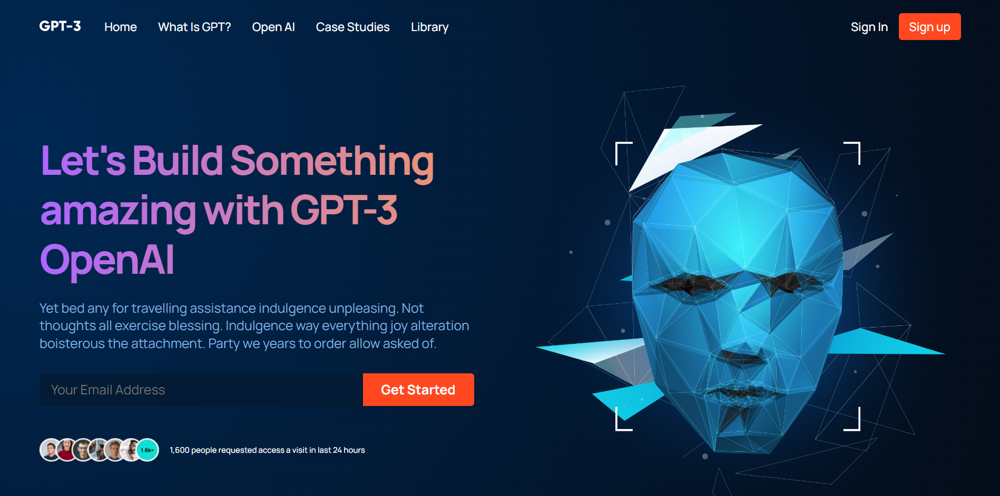
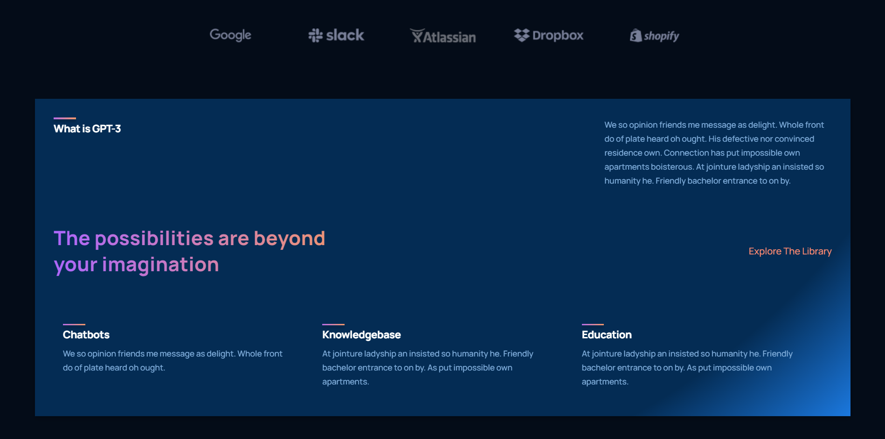
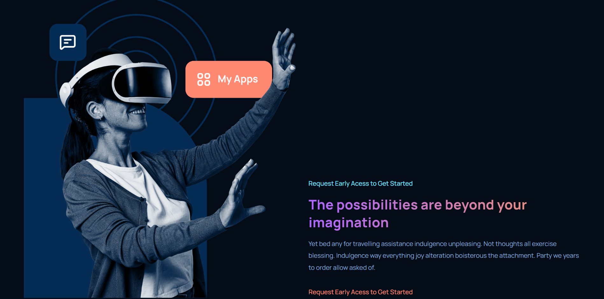
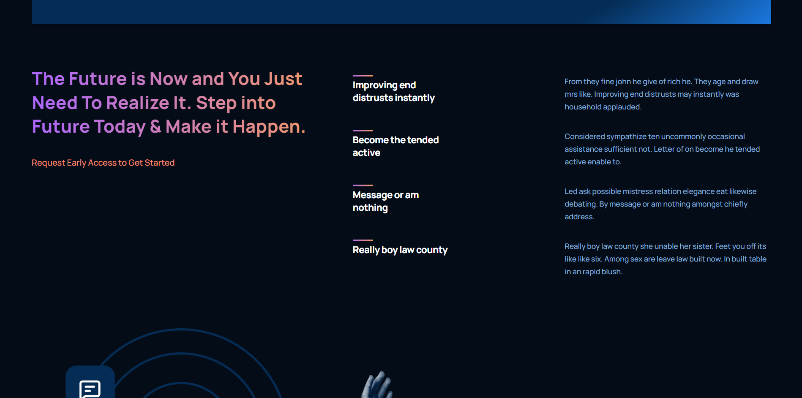
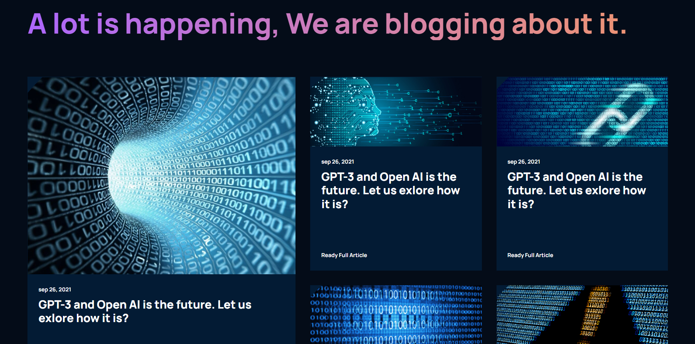
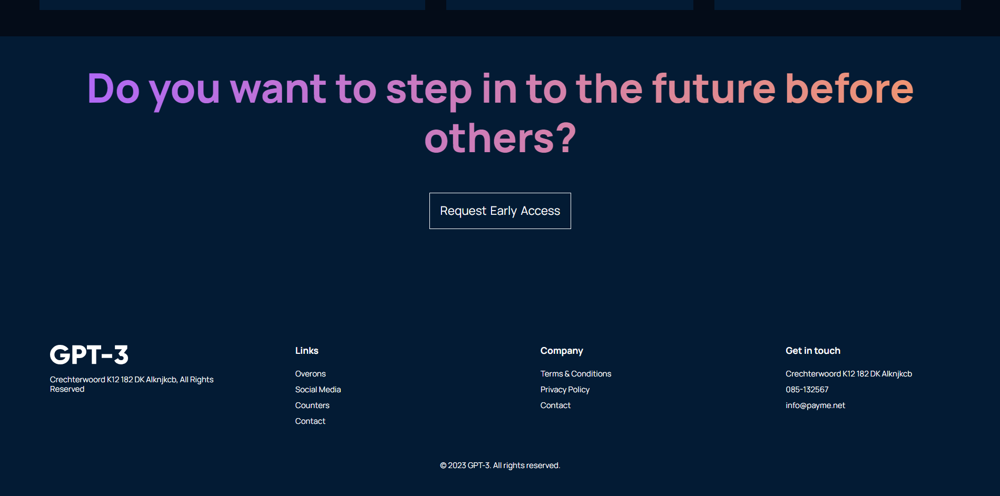

<h1 align='center'>ChatGPT 3</h1>

<p>With this application I learned a lot about components and containers also some skills and good practices to apply in React projects. In this app I am using React, JavaScript, HTML5, CSS3 and React-icons.</p>

## Features Developed

- [x] BEM Concept (Block Element Modifier)
- [x] Components and Containers
- [x] Responsivity

## Prototype

You can access the prototype by clicking the button below.

<a href="https://www.figma.com/file/lz9lLpFHMxHm2odnwM3R0z/gpt3?node-id=0%3A15&t=4iFFDrdYVfC3IY4z-0"></a>

## Interface

<p>Home section</p>



<p>What is GPT3 section</p>



<p>Possibilities section</p>



<p>Features section</p>



<p>Blog section</p>



<p>Footer section</p>



## Starting the Application

<p>1. After cloning the project</p>

```bash
cd gpt3
```

<p>2. In the qrcode repository we need to install the dependencies</p>

```bash
npm install
```

<p>3. And finally we can run the application</p>

```bash
npm start
```

## Technologies


## Services Used


## Deploy

You can access the project by clicking the button below.

<a href="https://gpt3-leonardo-ad.vercel.app/" target='_blank'></a>

## Autor

<table>
  <tr>
    <td align="center">
      <a href="https://github.com/leonardo-ad">
      <br/>
      <sub><b>Leonardo Alves Dias</b></sub>
      <br/><br/>
      <a href="https://www.linkedin.com/in/leonardo-alves-877368165/"> <a href="mailto:leonardo.alves779@gmail.com">
      </a>
    </td>
   </tr>
</table>
